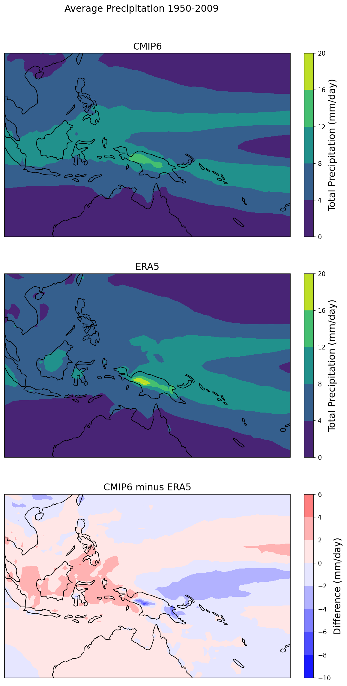

# CMIP6 Precipitation Cookbook



[](https://github.com/ProjectPythia/cookbook-template/actions/workflows/nightly-build.yaml)
[](https://binder.projectpythia.org/v2/gh/ProjectPythia/cookbook-template/main?labpath=notebooks)
[](https://zenodo.org/badge/latestdoi/475509405)


This Project Pythia Cookbook covers methods to analyze precipitation data from CMIP6 historical and future climate simulations. Including an analysis of spatial and temporal total precipitation trends and validation of historical runs vs. a reanalysis dataset (ECMWF ERA5).

## Motivation

The motivation for this cookbook is to provide useful calculations and visualizations of global precipitation in CMIP6 simulations. This can be applied to precipitation analysis of other datasets, along with the analysis of other variables included in CMIP6. 

## Authors

Aidan Alwang (https://github.com/aalwang)

### Contributors

<a href="https://github.com/ProjectPythia/cookbook-template/graphs/contributors">
  
</a>

## Structure

This cookbook is broken into two primary sections including an  introduction and notebooks section. 

### Introduction

This provides an overview of the cookbooks data and motivation.

### Notebooks

The notebooks section holds two notebooks that contain the bulk of the content found in this cookbook. 

## Running the Notebooks

You can either run the notebook using [Binder](https://binder.projectpythia.org/) or on your local machine.

### Running on Binder

The simplest way to interact with a Jupyter Notebook is through
[Binder](https://binder.projectpythia.org/), which enables the execution of a
[Jupyter Book](https://jupyterbook.org) in the cloud. The details of how this works are not
important for now. All you need to know is how to launch a Pythia
Cookbooks chapter via Binder. Simply navigate your mouse to
the top right corner of the book chapter you are viewing and click
on the rocket ship icon, (see figure below), and be sure to select
“launch Binder”. After a moment you should be presented with a
notebook that you can interact with. I.e. you’ll be able to execute
and even change the example programs. You’ll see that the code cells
have no output at first, until you execute them by pressing
{kbd}`Shift`\+{kbd}`Enter`. Complete details on how to interact with
a live Jupyter notebook are described in [Getting Started with
Jupyter](https://foundations.projectpythia.org/foundations/getting-started-jupyter).

Note, not all Cookbook chapters are executable. If you do not see
the rocket ship icon, such as on this page, you are not viewing an
executable book chapter.


### Running on Your Own Machine

If you are interested in running this material locally on your computer, you will need to follow this workflow:

(Replace "cookbook-example" with the title of your cookbooks)

1. Clone the `https://github.com/ProjectPythia/cookbook-example` repository:

   ```bash
    git clone https://github.com/ProjectPythia/cookbook-example.git
   ```

1. Move into the `cookbook-example` directory
   ```bash
   cd cookbook-example
   ```
1. Create and activate your conda environment from the `environment.yml` file
   ```bash
   conda env create -f environment.yml
   conda activate cookbook-example
   ```
1. Move into the `notebooks` directory and start up Jupyterlab
   ```bash
   cd notebooks/
   jupyter lab
   ```
